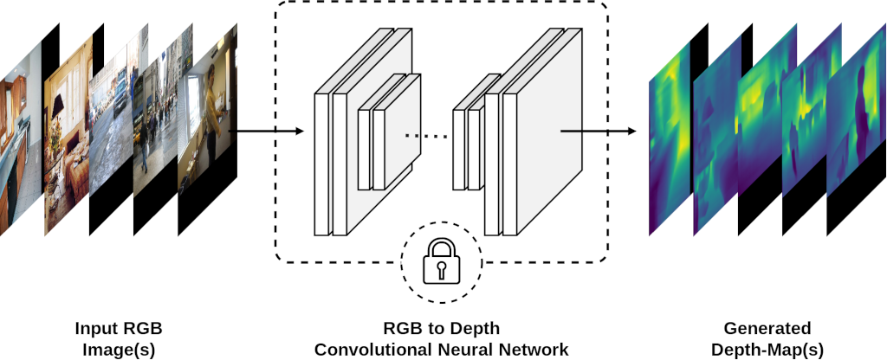

# Visual-Genome to Depth Maps

The goal of this repository is to convert the RGB images of [Visual-Genome](https://visualgenome.org/) dataset to Depth Maps. This code is part of our paper called [<i>"Improving Visual Relation Detection using Depth Maps"</i>](https://arxiv.org/abs/1905.00966) and is used to generate VG-Depth dataset. 
For further information, please visit the main repository [here](https://github.com/Sina-Baharlou/Depth-VRD).

This code is based on RGB-to-Depth architecture introduced in (Laina et al., 2016) [FCRN-DepthPrediction](https://github.com/iro-cp/FCRN-DepthPrediction). The architecture is a fully convolutional neural network built on ResNet-50, and trained in an end-to-end fashion on data from NYU Depth Dataset v2.

<p align="center"></p>

## Requirements
The requirements of this project are as follows:

>- Python >= 3.6 
>- Tensorflow
>- Numpy
>- Pillow

## Setup
You can run the following script to install the required libraries and download the other dependencies:

```
./setup_env.sh
```

This script will perform the following operations:

1. Install the required libraries.
2. Download the FCRN checkpoint.
2. Download the Visual-Genome dataset.

## How to Run

After installing the dependencies, you can perform the conversion by calling convert.py with one of the provided configuration files as an argument:

```
python3 convert.py json/vg_images/convert_vg_1024.json
``` 

